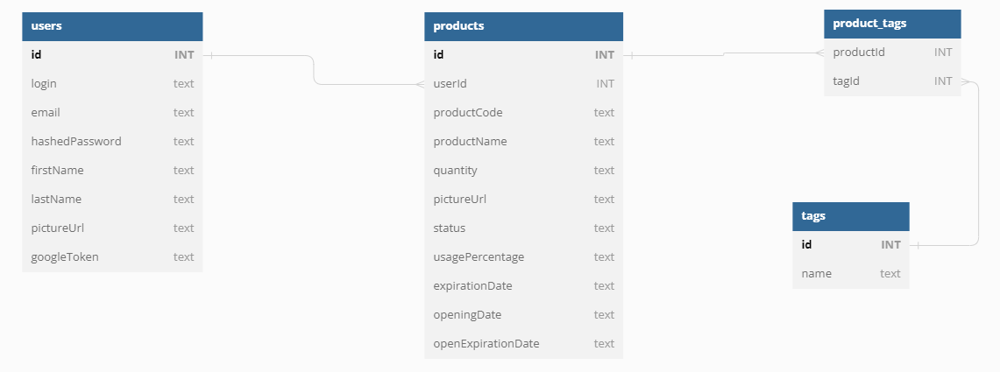

## 1. Diagram encji

## 2. API

POST /api/auth/login  
POST /api/auth/register  
POST /api/auth/google

GET /api/stats  
GET /api/me

GET /api/products  
GET /api/products/{product_id}  
POST /api/products  
PATCH /api/products/{product_id}  
DELETE /api/products/{product_id}
