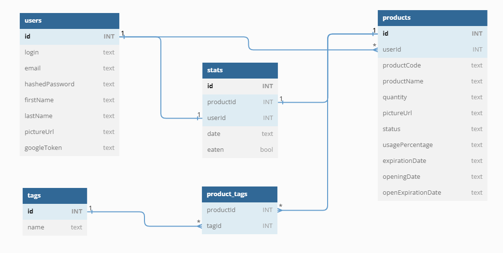

## 1. Diagram encji



## 2. API

POST /api/auth/login  
POST /api/auth/logout  
POST /api/auth/register  
POST /api/auth/google

GET /api/stats  
GET /api/tags  
GET /api/me

GET /api/products  
GET /api/products/{product_id}  
POST /api/products  
PATCH /api/products/{product_id}  
DELETE /api/products/{product_id}

### **_POST /api/auth/login_**

**_Przykładowe żądanie_**

```json
{
  "login": "test",
  "hashedPassword": "test"
}
```

**_Przykładowa odpowiedź_**

```json
{
  "status": "SUCCESS",
  "message": "Successful login."
}
```

### **_POST /api/auth/logout_**

**_Przykładowe żądanie_**

```json

```

**_Przykładowa odpowiedź_**

```json
{
  "status": "SUCCESS",
  "message": "Successful logout."
}
```

### **_POST /api/auth/register_**

**_Przykładowe żądanie_**

```json
{
  "login": "test1234",
  "email": "test1234@gmail.com",
  "hashedPassword": "test",
  "firstName": null,
  "lastName": null,
  "pictureUrl": null
}
```

**_Przykładowa odpowiedź_**

```json
{
  "status": "SUCCESS",
  "message": "Successful registration."
}
```

### **_POST /api/auth/google_**

**_Przykładowe żądanie_**

```json
{
  "googleToken": "abcd",
  "email": "jan@gmail.com",
  "login": "janek",
  "firstName": null,
  "lastName": null,
  "pictureUrl": null
}
```

**_Przykładowa odpowiedź_**

```json
{
  "status": "SUCCESS",
  "message": "Successful login."
}
```

### **_POST /api/me_**

**_Przykładowe żądanie_**

```json

```

**_Przykładowa odpowiedź_**

```json
{
  "status": "SUCCESS",
  "data": {
    "login": "janek",
    "email": "jan@gmail.com",
    "firstName": null,
    "lastName": null,
    "pictureUrl": null
  }
}
```

### **_POST /api/stats_**

**_Przykładowe żądanie_**

```json

```

**_Przykładowa odpowiedź_**

```json
{
  "status": "SUCCESS",
  "data": {
    "eatenCount": "0",
    "disposedCount": "0"
  }
}
```

### **_POST /api/tags_**

**_Przykładowe żądanie_**

```json

```

**_Przykładowa odpowiedź_**

```json
{
  "status": "SUCCESS",
  "data": [
    {
      "id": 1,
      "name": "Słodycze"
    },
    {
      "id": 2,
      "name": "Mięso"
    },
    {
      "id": 3,
      "name": "Napoje"
    },
    {
      "id": 4,
      "name": "Zimne"
    }
  ]
}
```

### **_GET /api/products_**

**_Parametr ścieżki_**

- **_status_** - przyjmuje wartości **exists**, **disposed**, **eaten**

**_Przykładowe żądanie_**

```json

```

**_Przykładowa odpowiedź_**

```json
{
  "status": "SUCCESS",
  "data": [
    {
      "id": 7,
      "userId": 1,
      "productCode": "5449000214911",
      "productName": "Coca-cola",
      "quantity": null,
      "pictureUrl": "https://images.openfoodfacts.org/images/products/544/900/021/4911/front_en.119.400.jpg",
      "status": "exists",
      "usagePercentage": null,
      "expirationDate": null,
      "openingDate": null,
      "openExpirationDate": null,
      "tags": [
        {
          "id": 4,
          "name": "Zimne"
        }
      ]
    },
    {
      "id": 9,
      "userId": 1,
      "productCode": "5449000214911",
      "productName": "Coca-cola",
      "quantity": null,
      "pictureUrl": "https://images.openfoodfacts.org/images/products/544/900/021/4911/front_en.119.400.jpg",
      "status": "exists",
      "usagePercentage": null,
      "expirationDate": null,
      "openingDate": null,
      "openExpirationDate": null,
      "tags": [
        {
          "id": 4,
          "name": "Zimne"
        },
        {
          "id": 3,
          "name": "Napoje"
        }
      ]
    }
  ]
}
```

### **_GET /api/products/{productId}_**

**_Przykładowe żądanie_**

```json

```

**_Przykładowa odpowiedź_**

```json
{
  "status": "SUCCESS",
  "data": {
    "id": 1,
    "userId": 1,
    "productCode": "5449000214911",
    "productName": "Coca-cola",
    "quantity": null,
    "pictureUrl": "https://images.openfoodfacts.org/images/products/544/900/021/4911/front_en.119.400.jpg",
    "status": "eaten",
    "usagePercentage": null,
    "expirationDate": null,
    "openingDate": null,
    "openExpirationDate": null,
    "tags": null
  }
}
```

### **_POST /api/products_**

**_Przykładowe żądanie_**

```json
{
  "productCode": 5449000214911,
  "productName": "Coca-cola",
  "pictureUrl": "https://images.openfoodfacts.org/images/products/544/900/021/4911/front_en.119.400.jpg",
  "status": "exists",
  "tags": [
    { "id": 3, "name": "Napoje" },
    { "id": 4, "name": "Zimne" }
  ]
}
```

**_Przykładowa odpowiedź_**

```json
{
  "status": "SUCCESS",
  "message": "Product added successfully."
}
```

### **_PATCH /api/products/{productId}_**

**_Przykładowe żądanie_**

```json
{
  "productCode": "5449000214911",
  "pictureUrl": "https://images.openfoodfacts.org/images/products/544/900/021/4911/front_en.119.400.jpg",
  "productName": "Coca-cola",
  "expirationDate": null,
  "openingDate": null,
  "openExpirationDate": null,
  "quantity": null,
  "status": "disposed",
  "usagePercentage": null
}
```

**_Przykładowa odpowiedź_**

```json
{
  "status": "SUCCESS",
  "message": "Product updated successfully."
}
```

### **_DELETE /api/products/{productId}_**

**_Przykładowe żądanie_**

```json

```

**_Przykładowa odpowiedź_**

```json
{
  "status": "SUCCESS",
  "message": "Product deleted successfully."
}
```
